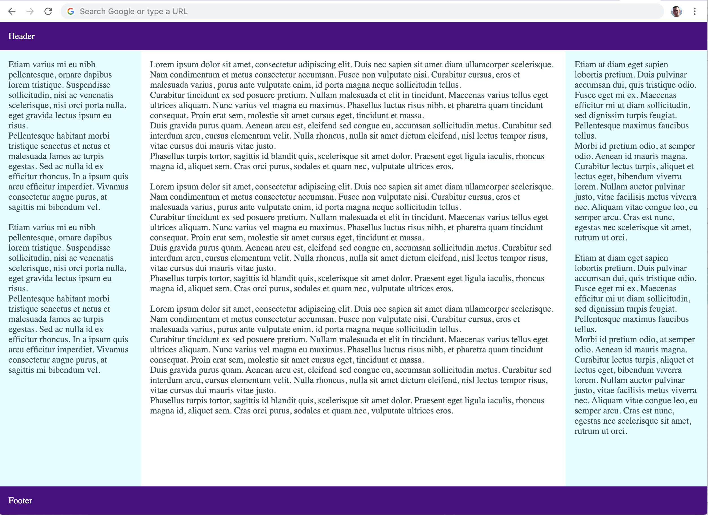

<sup>The Arming and Departure of the Knights. Number 2 of the Holy Grail tapestries woven by Morris & Co. 1891-94 for Stanmore Hall.</sup>

# Holy Grail Layout

The [Holy Grail](https://en.wikipedia.org/wiki/Holy_grail_(web_design)), in simple words, is a web page layout with multiple, columns having same heights and are specified with styling sheets. Although it has always been preferred to be used by developers but for many years the methods of implementation using the existing technologies had numerous drawbacks. As a result, the need to explore and determine an optimal implementation methodology lead to the adoption of Holy Grail.

```
+-------------------------------------+
|             HEADER AREA             |
+---------+-----------------+---------+
|         |                 |         |
|         |                 |         |
| SIDEBAR |     CONTENT     | SIDEBAR |
|         |                 |         |
|         |                 |         |
+---------+-----------------+---------+
|             FOOTER AREA             |
+-------------------------------------+
```
Web standards recently have incorporated further end-to-end and robust solutions in order to execute the layout shown above. Particularly the [CSS Flexible Box Layout](https://developer.mozilla.org/en-US/docs/Web/CSS/CSS_Flexible_Box_Layout) and [CSS Grid Layout](https://developer.mozilla.org/en-US/docs/Web/CSS/CSS_Grid_Layout) modules are available with their complete solutions.

## Creating Flexible Box Layout

To keep things simple, we'll use Flexible Box Layout instead of Grid Layout since Internet Explorer 10+ is backward compatible. Therefore the directory structure will be as follows:

```shell
01-layout
├── styles
│   ├── flex.css
│   └── theme.css
└── index.html
```

So, consider creating an [index.html](index.html) page of the following structure:

```html
<body>
  <header>Header</header>
  <div id="main">
    <article>Content</article>
    <aside>Left sidebar</aside>
    <aside>Right sidebar</aside>
  </div>
  <footer>Footer</footer>
</body>
```

**Important Note:** It's very crucial to add `DOCTYPE`, `html`, and `head` sections to the [index.html](index.html) page.

If this page is opened in the browser, the texts will appear in rows. If they do, we can consider that this behavior is the accurate for [block-level elements](https://developer.mozilla.org/en-US/docs/Web/HTML/Block-level_elements) which will be useful in designing layouts for mobile devices.

Next, we create a folder for [styles](styles), and a file named [flex.css](styles/flex.css):

```css
* {
  box-sizing: border-box;
  margin: 0;
  padding: 0;
}

body {
  display: flex;
  flex-direction: column;
  min-height: 100vh;
}

#main,
#main > article {
  flex: 1;
}

@media only screen and (min-width: 768px) {
  #main {
    display: flex;
  }

  #main > aside {
    flex: 0 0 20%;
  }

  #main > aside:first-of-type {
    order: -1;
  }
}
```

## Detailed Explanation

Firstly, we reset all the indents (`margin`, `padding`, `border-box`) for all the available elements. The `border-box` tells the browser to account for any `border` and `padding` in the values we specify for any elements i.e. `width` and/or `height`.

Secondly, two things are set:
1) `flex`-related properties to the `body`, `#main` and `article` which allows us to resize our layout to full screen, and
2) `min-height` to `100vh` for `body` elements where `vh` signifies the percentage of height of the viewport.

Checkout [viewport percentage lengths](https://developer.mozilla.org/en-US/docs/Web/CSS/length#Viewport-percentage_lengths) for further information.

The rules henceforth apply only for screens larger than or equal to 768 pixels. Therefore, considering the current screen to be large enough, let's start building the layout with three columns:

The first step is to display a `#main` as flex box model.
The second step is to set our sidebars width to `20%`.
Finally, we move the first sidebar to the left end of the page.

Now, we link this [flex.css](styles/flex.css) file to our [index.html](index.html) page to the `<head>` section in the following way:

```html
<link href="./styles/flex.css" rel="stylesheet">
```

## Appearance Enhancement

For the purpose of improving our presentation, we can add few paddings to the [flex.css](styles/flex.css) file as shown below:

```css
aside, footer, header, #main > article {
  padding: 1em;
}
```

We create [theme.css](styles/theme.css) file using the following content:

```css
body {
  background-color: White;
  color: DarkSlateGray;
}

header,
footer {
  background-color: Indigo;
  color: White;
}

#main > aside {
  background-color: LightCyan;
}
```

Once done, link this file to the [index.html](index.html) page to the `<head>` section:

```html
<link href="./styles/theme.css" rel="stylesheet">
```

Additionally, we can add some text contents like [Lorem ipsum](https://www.lipsum.com/) for a better presentation.

## Testing Result

We're now ready to open [index.html](https://vpodk.github.io/clap/01-layout/) page using our browser, and it should appear as below:



---

<table width="100%">
<tr>
<td><a href="../">Home</a></td>
<td align="right">Next: <a href="../02-positions">Block Positions</a></td>
</tr>
</table>
